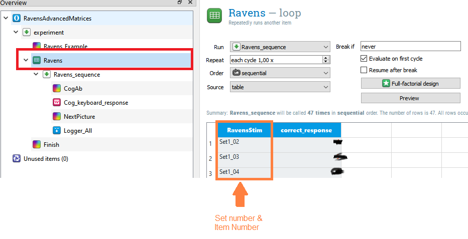
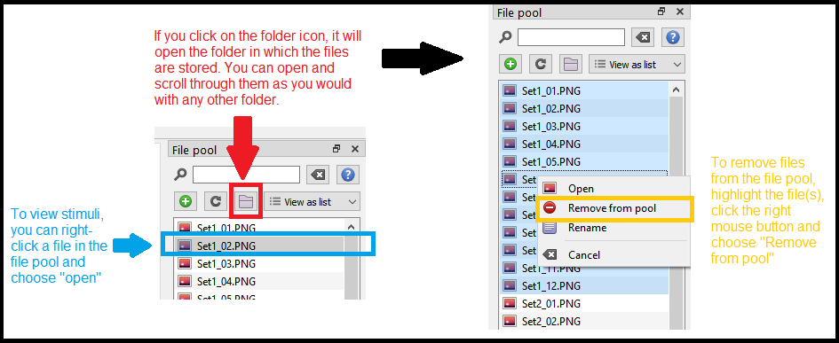

# Intelligence Tests

The intelligence tests listed in the following are copyright protected and therefore only available to staff and students at the University of Strathclyde.

The tests are suitable to test adults of below average intelligence, average intelligence, and above average intelligence. For children aged 4 to 11 years, the Crichton Vocabulary Scale and Coloured Progressive Matrices are included.

Remember to check if aspects of your experiment design may affect your measures. For example, bilinguals tend to perform worse on verbal intelligence tests than monolinguals but both groups perform equally well on non-verbal intelligence tests. Thus, if you think this may affect the outcome of your findings, you would want to record whether your participants are bilingual.


## Raven's Matrices for Adults

Three different sets of Raven's Matrices can be used to test non-verbal intelligence in adults:

1. **Raven's Progressive Matrices:** 60 matrices that become increasingly difficult
2. **Raven's Progressive Matrices Abbreviated Nine-item Forms:** short versions on  Raven's Progressive Matrices, each test only contains nine matrices
3.  **Raven's Advanced Progressive Matrices:** contains 48 items in two sets of matrices, and aims to assess non-verbal intelligence of adults and adolescents who can be expected to have above average intelligence

**How to use the Raven's Progressive Matrices**

To get a full picture of a person's intelligence, the Mill Hill Vocabulary Test (see below) should be administered alongside Raven's Matrices. For children, a Coloured Progressive Matrices and the Crichton Vocabulary Scale should be used instead. If you will be testing adults who would be expected to score below average intelligence, it may be appropriate to use the Coloured Progressive Matrices and Crichton Vocabulary Scale instead. It is best to discuss the choice of test with your supervisor.

**Formats**

At the moment, the following versions are available for Psychology students at the University of Strathclyde:

[Open Sesame Raven's Progressive Matrices - 9-items version](link to file) | [Open Sesame Raven's Advanced Progressive Matrices](link to file)

**Other Task Versions**

Raven's Matrices can also be implemented in Qualtrics. This will be done in due course. In the meantime, if you require access to the stimuli or the paper-based version of the task, please contact [Dr Jennifer Mattschey](mailto: Jennifer.Mattschey@strath.ac.uk), using your University of Strathclyde student or staff e-mail.


**Things you will need to know for your Methods section**

If you look at the **Ravens loop** in Raven's Advanced Progressive Matrices you will notice that the first matrix of Set I is not included in the loop. Instead, the first matrix of Set I is shown as an example for participants.

### Shortening Raven's Advanced Progressive Matrices

Raven's Advanced Progressive Matrices consist of two sets of stimuli: 

- **Set I:** 12 Stimuli
- **Set II:** 36 Stimuli

Participants often find it difficult to focus for a long time on online experiments so you may wish to remove a set or some of the stimuli. To do this, open the file in Open Sesame and select the **"Ravens" loop**. You will see a table that lists each stimulus and the correct response. Simply highlight the items that you want to remove, right-click on them, and choose "delete row."


```{r Figure1-1, out.width = '99%', fig.align = 'center', echo = FALSE, fig.cap = 'Remove items from the experiment by identifying them in the "Ravens" loop and deleting the corresponding row. Correct responses are blacked out.'}


```


If you remove stimuli this way, they will no longer be shown to participants. They will, however, remain in the "file pool", i.e. the folder in which Open Sesame stores the picture files. To view and/or remove these picture files, we need to access the File Pool. To do this, click on **View** -> **Show file pool** in Open Sesame's menu. Alternatively, press **Ctrl + P**. 

As shown in Figure 4.2. below, you can view the stimuli in two different ways, either in Open Sesame or by opening the source folder. If you want to delete stimuli, highlight them in the file pool, right-click, and choose "Delete from pool." In the example below, all stimuli in Set I are removed. 


```{r Figure1-2, out.width = '99%', fig.align = 'center', echo = FALSE, fig.cap = 'To view stimuli, or remove them from the Open Sesame file completely, you need to open the file pool.'}


```

You do not have to remove pictures from the file pool as long as they have been removed from the loop. However, removing them from the file pool means the Open Sesame file of your experiment will be smaller. It is also helpful to remove any files you will not be using if you want to combine different tasks. For example, the Mill Hill Vocabulary Task and Raven's Advanced Progressive Matrices. 

## Mill Hill Vocabulary Scale
The Mill Hill Vocabulary Scale is a measure of linguistic ability (Raven, 2003). It contains two sets of words, Set A and Set B. The paper-based version presents participants with one of these sets as open ended questions ("What is the meaning of this word?") and the second set as multiple choice questions. As Open Sesame does not currently support form elements for online testing, the Open Sesame files below only contain the multiple-choice version of Set A and Set B. Only one set of words should be included in an experiment. 

**Formats**

The Mill Hill Vocabulary Scale Open Sesame files are suitable to be used online or offline.

[Open Sesame - Set A](link here) | [Open Sesame - Set B](link here)


**Things you will need to know for your Methods section**

The files for Set A and Set B both contain an example as part of the task instructions, which asks participants to identify a word similar to "Malaria" out of six choices: “01 – basement”, “02 – theatre”, “03 – ocean”, “04 – fever”, “05 – fruit”, and “06 – tune”. Malaria is the first word in the multiple-choice version of Set B. It is, however, also the example provided for Set A. The first multiple-choice word for Set A is currently not included in either set, to ensure an equal number of multiple-choice questions between sets.

**How to shorten the Mill Hill Vocabulary Scale?**

Watts, Baddeley, and Williams (1982) found that a shortened version of the multiple-choice part of the Mill Hill Vocabulary Scale produced reliable findings. If you want to remove items, please follow the process outlined in *Shortening Raven's Advanced Progressive Matrices.*


**Mill Hill References**

Raven, J. C. (1958). *Guide to using the Mill Hill Vocabulary Scale with the Progressive Matrices Scales.* H. K. Lewis & Co.

Matarazzo, J. D. (1990). [Psychological assessment versus psychological testing.](https://www.gwern.net/docs/psychology/1990-matarazzo.pdf) *American Psychologist, 45*, 999–1017.

## Coloured Progressive Matrices

Raven's Coloured Progressive Matrices are similar to the Standard and Advanced Matrices. The Coloured Matrices include three sets of stimuli: 

- **Set A:** 12 Stimuli
- **Set AB:** 12 Stimuli
- **Set B:** 12 Stimuli

The Coloured Matrices were originally designed for childred, aged 4 to 11 years. However, if they are also suitable to be used with adults for whom the Standard Matrices may be too difficult to complete.

**Formats**

The Coloured Matrices are currently available as two different Open Sesame files. One for use on Android devices and one for use on a computer, either offline or online.

[Open Sesame - Online and Offline](link here) | [Open Sesame - Android](link here)

Using Android versions of tasks changes a few things, for example, you will to use a different Open Sesame version to make changes to it. Please check the relevant section of the Open Sesame chapter for more details.

## Crichton Vocabulary Scale

The Crichton Vocabulary Scale should be used together with the Coloured Progressive Matrices. It is a measure of verbal ability and requires participants to explain words, e.g. "What is a cap?" 

**Formats**

The Crichton Vocabulary Scale Consists of open ended questions only, hence, there is no multiple-choice option available. This means, you can only use it online if you use Qualtrics. For Open Sesame, you have the option to use forms or use the Android version below. 
The Android version is used by the experimenter and should not be seen by the participant. It allows you to decide whether the response was acceptable or not in real time by tapping the left or right side of a tablet screen. This may be suitable if you do not require a record of specific response. 

[Qualtrics](link here) | [Open Sesame - Android](link here) | [Paper-Based](link here)
