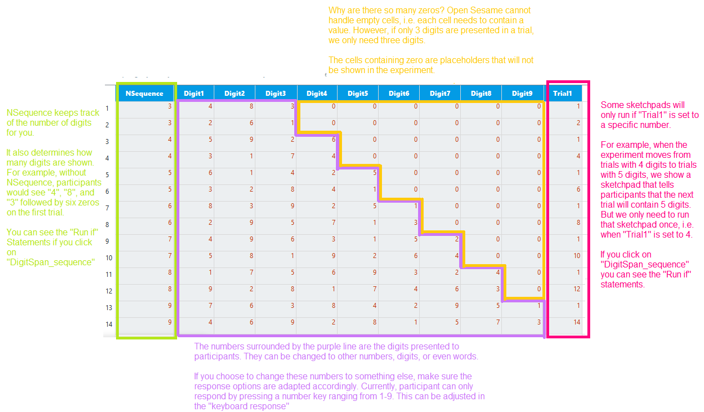

# Working Memory Tasks 

## Digit Span Task

Digit Span Tasks can be used to assess working memory span. Participants are presented with a series of digits and asked to recall digits correctly. The Open Sesame Task you will find below begins with two trials that ask participants to correctly recall three digits. This number increases every two trials, until participants are asked to recall 9 digits correctly. 

**Formats**

[Open Sesame - Offline & Online](GitHub/DigitSpan_Online.osexp) 

**Things you will need to know for your Methods section**

Because we cannot use the form function of Open Sesame online, participants are prompted to recall digits by individual "sketchpads", which are similar to slides in Power Point. However, this is not the most intuitive way to respond to this task. To ensure that participants know how to respond, they complete one practice trial with three digits. They receive feedback for each individual digit and need to get all three right in order to continue to the main experiment. If they get one or more digits wrong, they are reminded of what the three digits were and invited to try again. Once they have accurately identified all three digits, they can continue to the main experiment.

**Ways to adapt the Digit Span Task**

You may want to use different numbers, letters, or even words. This can be done by opening **DigitSpan_Loop** and changing the numbers that are entered as the digits to be shown. Figure 3.1. explains the key sections of the loop table. To see a bigger version of the image, [click here](https://raw.githubusercontent.com/jmattschey/MScConversionExperiments/master/images/ChangeDigitSpan.png)

```{r Figure2-1, out.width = '99%', fig.align = 'center', echo = FALSE, fig.cap = 'You can change the digits that are shown to participants by changig the numbers framed in purple.'}


```

If the digits are changed to single numbers or letters, all you need to do is to adjust the allowed responses in the "keyboard_response" items to allow these numbers and/or letters. If you want to use words instead, you can use the "form" function in Open Sesame to replace the keyboard response with. This allows participants to freely recall a word but, **importantly, the form function cannot currently be used for online experiments, as it is not supported.**

