# Attention Tasks

## Attentional Network Task (ANT)
Attentional Network Tasks (ANTs) aim to assess performance in relation to the three attentional networks proposed by Posner and Petersen (1990): alerting, orienting, and executive control. The executive control network is sometimes also called "conflict network." ANTs combine the cued reaction time paradigm proposed by Posner (1980) and the Eriksen Flanker Task (Eriksen, & Eriksen, 1974). The former requires participants to identify on which side (i.e. right or left) a target appeared, while the latter asks participants to identify a target surrounded by distractors.

The ANT included in this experiment library is based on the task version proposed by Fan, McCandliss, Sommer, Raz, and Posner (2002). The task includes five different cues. Some inform the participant that a target is about to appear and where. Others only let the the participant know that the target will appear shortly but not where. Finally, on some trials, the target will appear without a cue preceding it. Figure 4.2. shows the overview of cues participants see prior to starting the experiment.

```{r Figure3-2, out.width = '80%', fig.align = 'center', echo = FALSE, fig.cap = 'Targets can be preceded by five different types of cues.'}

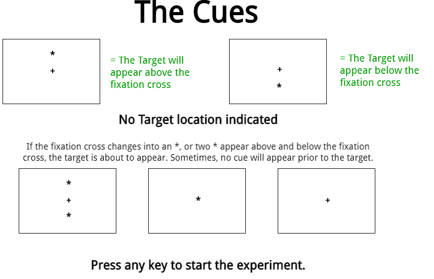
```

The targets in this task version are arrows, which can appear either above or below the fixation cross. They are surrounded by distractor stimuli, which can either be congruent (i.e. arrows pointing in the same direction), incongruent (i.e. arrows pointing in the opposite direction), or neutral (in this case, a line or dash). Figure 4.3. shows the different types of target displays as they are explained to the participant.

```{r Figure3-3, out.width = '80%', fig.align = 'center', echo = FALSE, fig.cap = 'Targets can be surrounded by congruent, incongruent, or neutral stimuli.'}

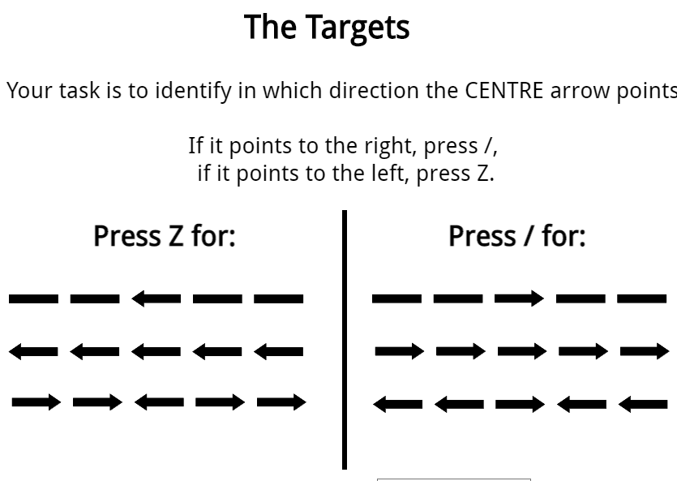
```


**How are measures for the three attentional networks obtained?**

Performance in relation to the three networks can be assessed based on differences in reaction time and/or accuracy. This is done by comparing performance on trials with different cue types:

- **Alertness Network:** difference between the no-cue and the double cue condition
- **Orienting Network:** difference between the centre cue and spatial cue condition
- **Executive Control:** difference between trials with congruent flankers and trials with incongruent flankers


**Formats**

The task is available in two different Open Sesame formats: 

[Open Sesame Offline - Python](https://github.com/jmattschey/MScConversionExperiments/blob/master/GitHub/ANT_OfflineWithPython.zip) | [Open Sesame Online - JavaScript](https://github.com/jmattschey/MScConversionExperiments/blob/master/GitHub/ANT_OnlineWithJS.zip) 

**Things you will need to know for your Methods section**

The ANT designed by Fan et al. (2002) displays the first fixation cross of each trial for 400-1600ms, which is determined randomly. The display duration of the last fixation cross is determined by subtracting the duration of the first fixation cross from 3500ms. So if the first fixation cross was on screen for 500ms, the last fixation cross would be displayed for 3000ms, because 3500 - 500 = 3000. To randomly calculate these numbers, each Open Sesame file has an inline script. For the online version, it is written in Javascript, for the offline version in Python.

**ANT References**

Eriksen, B. A., & Eriksen, C. W. (1974). [Effects of noise letters upon the identification of a target letter in a nonsearch task.](https://link.springer.com/content/pdf/10.3758/BF03203267.pdf) *Perception & Psychophysics, 16*(1), 143-149.

Fan, J., McCandliss, B. D., Sommer, T., Raz, A., & Posner, M. I. (2002). [Testing the efficiency and independence of attentional networks.](http://citeseerx.ist.psu.edu/viewdoc/download?doi=10.1.1.474.442&rep=rep1&type=pdf) *Journal of Cognitive Neuroscience, 14*(3), 340-347.

Posner, M. I., & Petersen, S. E. (1990). [The attention system of the human brain.](https://apps.dtic.mil/dtic/tr/fulltext/u2/a206157.pdf) *Annual Review of Neuroscience, 13*(1), 25-42.


## Simon Task

The Simon Task is based on the observation that people respond faster and with higher accuracy if the stimulus they respond to and the required response share features, for example, location (Simon, & Wolf, 1963; Simon, & Rudell, 1967). One version of the task requires participants to identify the colour of squares (e.g. Gulbinaite, van Rijn, & Cohen, 2014). Figure 4.4. shows an example of such a task. Squares are either presented on the right or left side of the screen. The response keys, M and Z, are located on the left and right side of the keyboard (if we are using a QWERTY keyboard). This means the response location (left vs. right) and the presentation location (left vs. right) can either match or mismatch. 


```{r Figure3-4, out.width = '80%', fig.align = 'center', echo = FALSE, fig.cap = 'Example sequence of a Simon Task with coloured squares.'}

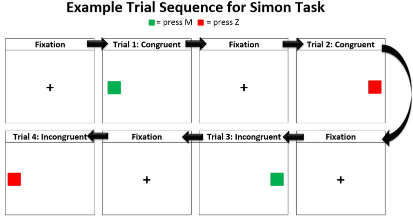
```

If the square is red, participants should press Z, which is located on the left side of the keyboard, regardless of where the square appears. If the red square appears on the left side of the screen (i.e. congruent trial), participants tend to be faster and commit overall fewer errors than if the red square appears on the right side of the screen (i.e. incongruent trial).

Other variations of the task use the written words "left" and "right", or arrows.

**Formats**

The coloured square version of task is available for Open Sesame: 

[Open Sesame - Online & Offline](https://github.com/jmattschey/MScConversionExperiments/blob/master/GitHub/SimonTask.zip) 


### What if I want to change the task from squares to arrows or something else?

Open the Simon Task and identify the following two sketchpads:

- Pract_Target

- Simon_Target

Choose Pract_Target and you will see something like this:

```{r Figure3-5, out.width = '99%', fig.align = 'center', echo = FALSE, fig.cap = 'This is what the Target display looks like in the experiment file.'}

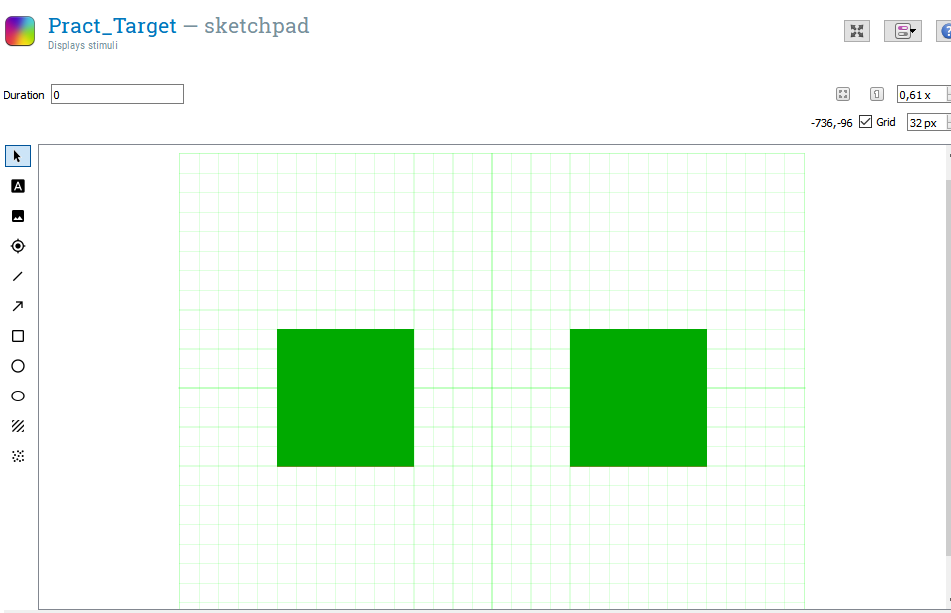
```

Now we want to switch to the script view, by clicking on the functions framed in red below:

```{r Figure3-6, out.width = '99%', fig.align = 'center', echo = FALSE, fig.cap = 'Every step of the experiment is based on an underlying script. This is the script that displays the targets, i.e. the coloured squares.'}

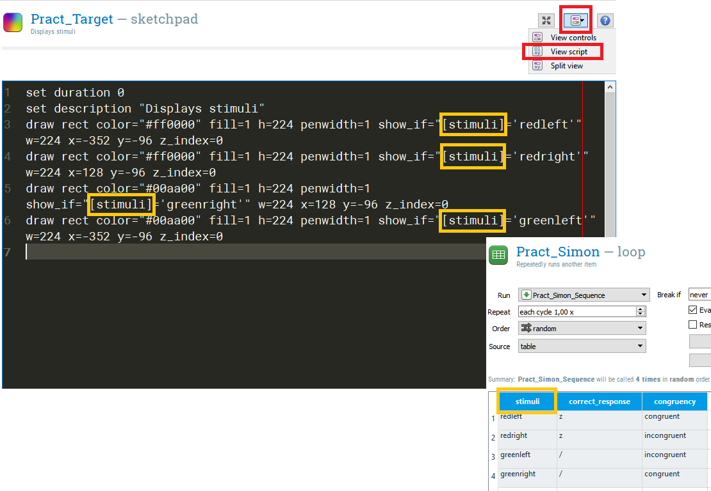
```

You will also notice some "show_if" statements framed in orange. These relate back to the Pract_Simon loop in which we tell Open Sesame that we want four types of stimuli: a green square presented on the left or right, and a red square presented on the left or right. Now let's say we want this to change so that an arrow instead of a square is presented, e.g. like in Stoet (2017).

Our first step is to go back to choose **"View Controls"** (between red frames in the picture above). When you are back in the control view, click on the green squares and delete them.


```{r Figure3-7, out.width = '99%', fig.align = 'center', echo = FALSE, fig.cap = 'The first step to change the task from squares to arrows is to remove the squares from the target display.'}


if (knitr:::is_latex_output()) {
  knitr::asis_output('\\url{....}')
} else {
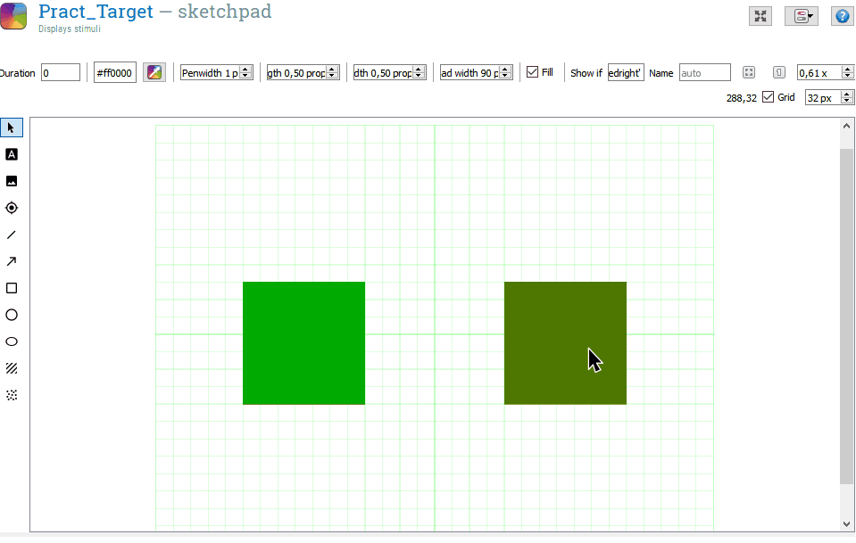
}
```


Once the squares have been removed, we can draw arrows to replace them. You can play around with the different settings to shape the arrow to your liking. Once the arrows are drawn, they can be moved around in the Control view to place them where you want them to be.


```{r Figure3-8, out.width = '99%', fig.align = 'center', echo = FALSE, fig.cap = 'The first step to change the task from squares to arrows is to remove the squares from the target display.'}

if (knitr:::is_latex_output()) {
  knitr::asis_output('\\url{....}')
} else {
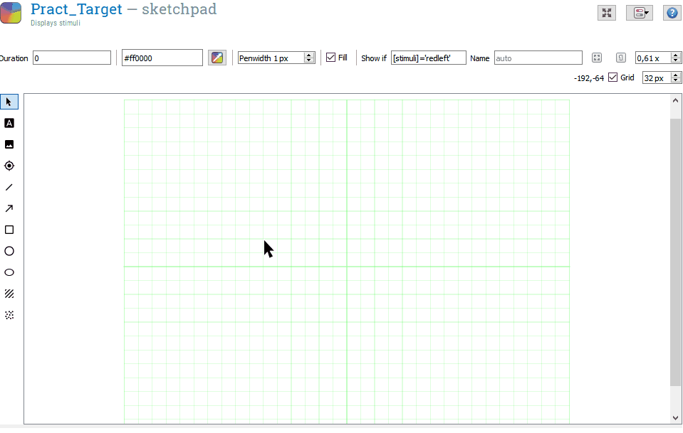
}
```

We want to draw four arrows: two positioned on the left, two positioned on the right. The two arrows on each side of the screen should point into opposite directions, i.e. one points left, one points right. The arrow task version usually does not require differently coloured arrows and arrows tend to be black. You can change the colour in the the script view or in the controls view (see Figure 4.9. below).

```{r Figure3-9, out.width = '60%', fig.align = 'center', echo = FALSE, fig.cap = 'You can change the colour of the displayed arrows in the script or control view.'}

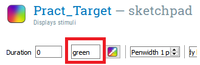
```

Because the arrows overlap in the control view, it can be difficult to tell them apart. However, we need to make sure that we assign the right "show if" argument to each arrow. One way to make this a little easier is to temporarily give each arrow a different colour.

```{r Figure3-10, out.width = '99%', fig.align = 'center', echo = FALSE, fig.cap = 'Draw two arrows in the same locatio that point into the opposite direction but are in the same location. To make it easier to tell the arrows apart in the script view, we can change their colour.'}

if (knitr:::is_latex_output()) {
  knitr::asis_output('\\url{....}')
} else {
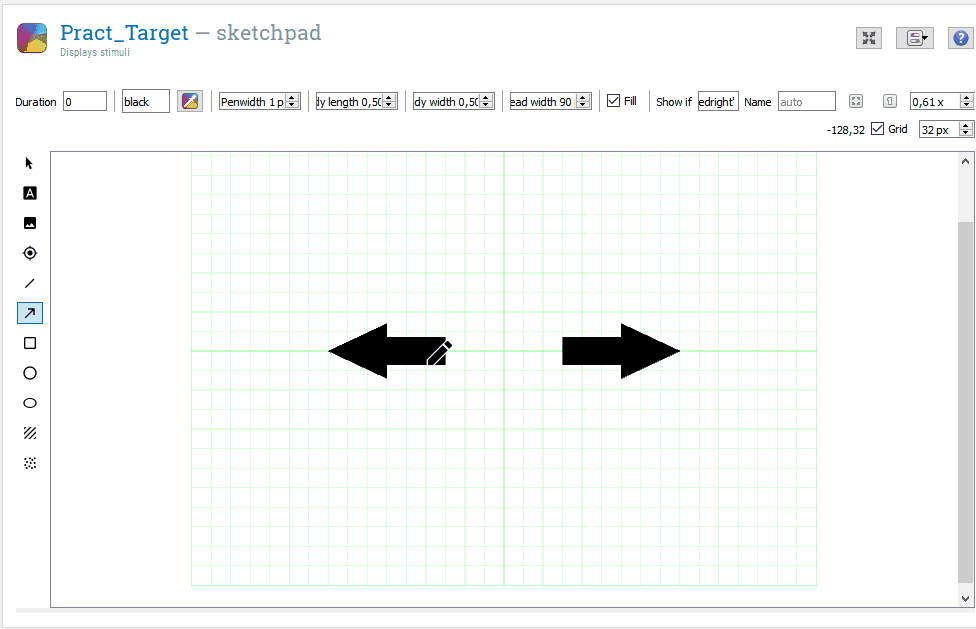
}
```

Choose colours you will find easy to tell apart. The example below uses "red", "green", "pink" and "blue." If we click on script view, we can clearly see which arrow is which.

```{r Figure3-11, out.width = '99%', fig.align = 'center', echo = FALSE, fig.cap = 'Close up of the four arrow colours and how they relate to the code we see in the script view.'}

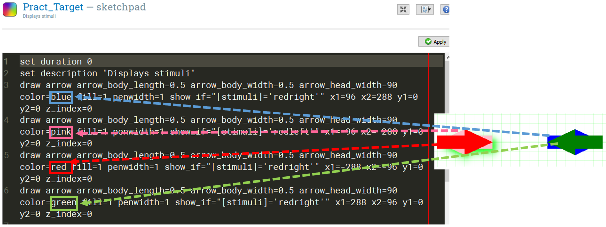
```

The next step depends on what specifically you want to ask your participants to do. For the example, we want participant to respond with Z if the arrow points left and with M if the arrow points right. To reflect this change in task, we need to change the "stimuli" column in the loop element:

```{r Figure3-12, out.width = '99%', fig.align = 'center', echo = FALSE, fig.cap = 'We need to change the stimuli column in the loop to reflect the change in stimuli.'}

knitr::include_graphics('images/changesimon/06Loop.png')
```

The system used to name the stimuli lists the location of the arrow first, followed by its direction. Thus "rightleft" will draw an arrow on the right side of the screen that points towards the left. This means we also need to change the correct response in two cases (framed in green). Now that we have defined this in the loop, we can make the appropriate changes in the target sketchpad. There are two ways to do this. 

**Option 1: Script view**

Go into script view and change "show_if" so that the arrows are only drawn when we want them to be drawn. You will be able to tell them apart based on their colour.

```{r Figure3-13, out.width = '99%', fig.align = 'center', echo = FALSE, fig.cap = 'One way to adjust the show if statement is by changing it in the script.'}

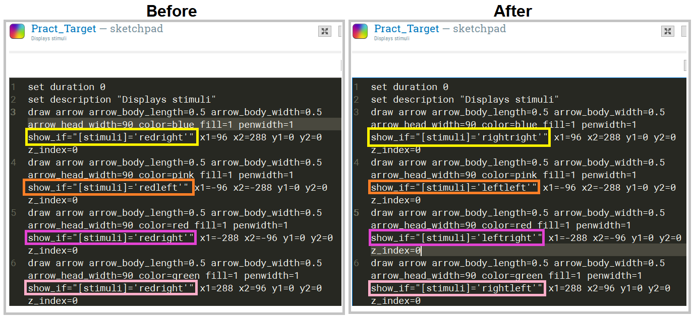
```

After this is done, you can change to colour of all arrows to black.

**Option 2: Control view**

In the control view, click on each arrow and change the "show if" statement. The arrow you have selected will have a green shadow. If you choose this method, you need to be particularly careful to choose the correct arrow.

```{r Figure3-14, out.width = '99%', fig.align = 'center', echo = FALSE, fig.cap = 'We can also change the show if statement in the control view.'}

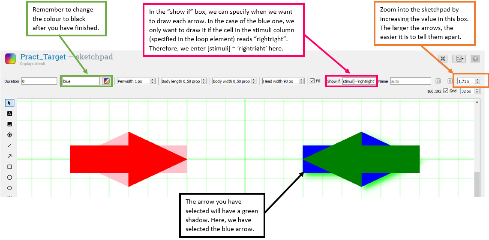
```

Once you have completed these steps, do the same for the Simon_Block loop and the Simon_Target sketchpad in the experimental block. 

**Remember to change the instructions. Hint: You can copy-paste the script to the sketchpad in the experiment block but you still need to change the loop in the experimental block.**


### Change the response keys

If you want to change the response keys, the first step is to change them in the loop.

```{r Figure3-15, out.width = '99%', fig.align = 'center', echo = FALSE, fig.cap = 'To change the required responses, change the correct response in the loop element.'}

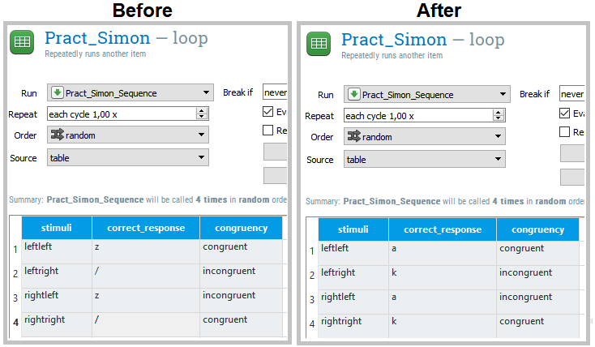
```

The second step is to change the accepted responses in the keyboard response.

```{r Figure3-16, out.width = '99%', fig.align = 'center', echo = FALSE, fig.cap = 'The second step is to change the responses we allow in the keyboard element.'}

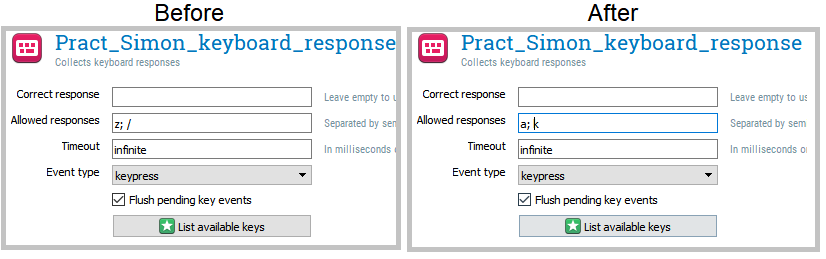
```

Once you have done this for the practice block, remember to do the same for the experimental block and to change the instructions accordingly.


**Simon Task References**


Gulbinaite, R., van Rijn, H., & Cohen, M. X. (2014). [Fronto-parietal network oscillations reveal relationship between working memory capacity and cognitive control.](https://www.frontiersin.org/articles/10.3389/fnhum.2014.00761/full) *Frontiers in Human Neuroscience, 8*, 761.

Simon, J. R., & Rudell, A. P. (1967). [Auditory SR compatibility: the effect of an irrelevant cue on information processing.](https://suprimo.lib.strath.ac.uk/permalink/f/1jihtat/TN_cdi_proquest_journals_614414775) *Journal of Applied Psychology, 51*(3), 300.

Simon, J. R., & Wolf, J. D. (1963). [Choice reaction time as a function of angular stimulus-response correspondence and age.] (https://www.tandfonline.com/doi/abs/10.1080/00140136308930679) *Ergonomics, 6*(1), 99-105.

Stoet, G. (2017). [Sex differences in the Simon task help to interpret sex differences in selective attention.](https://link.springer.com/content/pdf/10.1007/s00426-016-0763-4.pdf) *Psychological Research, 81*(3), 571-581.


## Stroop Task

The Stroop Task (Stroop, 1935) is an interference control task that requires participants to identify the font colour in which colour words are written in. The word and the font colour can be  either congruent, e.g. <span style="color: red;">RED</span>, or incongruent, e.g. <span style="color: green;">BLUE</span>. On incongruent trials, reaction time generally increases while accuracy decreases. The difference in performance between congruent and incongruent trials is also referred to as the Stroop Effect. 

**Formats**

The Stroop Task is available for Open Sesame: 

[Open Sesame - Online & Offline](https://github.com/jmattschey/MScConversionExperiments/blob/master/GitHub/StroopTask.zip) 

### How to change the words and/or colours

To change either the words that are displayed or the colour they are displayed in, you need to locate the Pract_Stroop and Stroop_Loop in the experiment file. The Figure below explains what each column defines.

```{r Figure3-17, out.width = '99%', fig.align = 'center', echo = FALSE, fig.cap = 'Overview of what wach column in the Pract_Stroop loop defines.'}

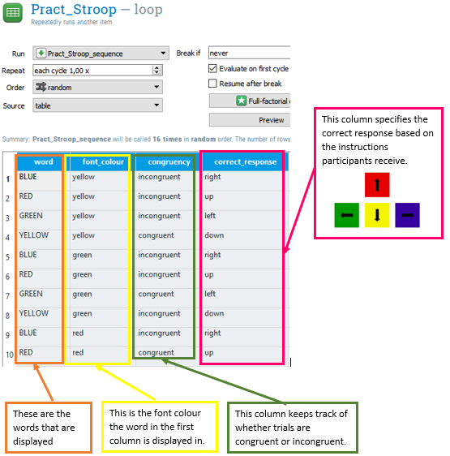
```

If you want to change the word that is displayed, for example from "RED" to "PURPLE", the words in the first column (framed in orange) needs to be changed. If you want to change the font colour, for example from <span style="color: red;">RED</span> to <span style="color: green;">RED</span>, this needs to be done in the second column, framed in yellow. Instead of colour names, you can also enter [Hex Colour Codes](https://htmlcolorcodes.com/) to define the font colour. Remember that the changes you make need to reflected by the instructions you give to participants.

**Stroop References**

Stroop, J. R. (1935). [Studies of interference in serial verbal reactions.](https://pure.mpg.de/rest/items/item_2389918/component/file_2389917/content) *Journal of Experimental Psychology, 18*(6), 643.


## Inhibition of Return

For inhibition of return (IOR) tasks, participants are expected to identify the location in which a target appeared (often right vs left side of a computer screen). The target is preceded by a cue, which appears in the same location (valid cues) or in a different location (invalid cues). If the target appears within less than 300ms after the cue, participants respond fasterand with higher accuracy on trials with valid cues (i.e. target appears in the cued location) than on trials with invalid cues (Klein, 2000; Posner, & Cohen, 1984). If more than 300ms lie between the cue and the target, the opposite is the case: participants respond faster if the target appears on the opposite side of where the cue appeared. In other words, if the delay between cue and target is longer than 300ms, people respond faster on invalid trials. This is also known as 'validity effect.' 

Thus, if the cue appears after more than around 300ms, we appear to experience suppression of our ability to orient attention to the cued location. This suppression is the "inhibition of return" (e.g. to that display location). Posner and Cohen (1984) suggested that IOR facilitates the detection of novel information and may thus aid **visual search**.

**Formats**

The task is available for Open Sesame: 

[Open Sesame - Online & Offline](https://github.com/jmattschey/MScConversionExperiments/blob/master/GitHub/InhibitionofReturn.zip) 


**Things you will need to know for your Methods section**

Targets can appear 50ms, 200ms, 500ms or 800ms after the cue. You can change this by opening **"Pract_InhibitionOfReturn_loop"** and **"InhibitionOfReturn_loop"** and changing the values in the **"SOA"** column.

The paradigm used in the Open Sesame task is based on Zhao and Heinke (2014) but not identical to it.


**References**

Klein, R. M. (2000). [Inhibition of return.](https://www.researchgate.net/profile/Juan_Lupianez/publication/233995999_Inhibition_of_Return/links/0c960525d778745c66000000/Inhibition-of-Return.pdf) *Trends in Cognitive Sciences, 4*(4), 138-147.

Posner, M. I. , & Cohen, Y. (1984). *Components of visual orienting.* In: Bouma H, Bouwhuis DG, editors. Attention and Performance X: Control of Language Processes. X. London: Lawrence Erlbaum

Zhao, Y., & Heinke, D. (2014). [What causes IOR? Attention or perception?–Manipulating cue and target luminance in either blocked or mixed condition.](https://core.ac.uk/download/pdf/185482615.pdf) *Vision Research, 105*, 37-46.


