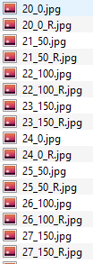

# Spatial Awareness

## Mental Rotation

During mental rotation tasks, participants are generally presented with two objects and asked to identify whether these objects are the same or different. The objects can be two-dimensional and three-dimensional, and one image is rotated by a few degrees (e.g. 50°, 100°,...) compared to the other. Below is an example image from the data set used in the Open Sesame task you can download below.


```{r Figure5-1, out.width = '75%', fig.align = 'center', echo = FALSE, fig.cap = 'Example of the stimuli used in the Open Sesame task that can be downloaded below. The stimuli were created by Ganis and Kievit (2015) and shared as an open dataset.'}

knitr::include_graphics('images/RotationExample.jpg')
```

**Formats**

The mental rotation task, with the stimuli created by Ganis and Kievit (2015), is available as a short and long Open Sesame file. The short version contains 96 stimuli pairs, the long version contain all 384 stimuli created by Ganis and Kievit.

[Open Sesame - Short Version](link to file) | [Open Sesame - Long Version](link to file)

**Things you will need to know for your Methods section**

Remember to cite Ganis and Kievit (2015) as the source of the stimuli. Check their article for details of how the stimuli.
The set they created includes 48 objects, each compared to itself and a different object rotated by 0°, 50°, 100°, and 150°. This means that for each angle and object, there is a pair of objects that are the same and a pair that shows two different objects. Below shows Object 1 and its corresponding pairs of stimuli as an example.

```{r Figure5-2, out.width = '99%', fig.align = 'center', echo = FALSE, fig.cap = 'Object 1 in the stimuli set created by Ganis and Kievit (2015). Each Object features in 8 picture pairs. Four of these pairs show the same object twice but at different rotation angles. The other four pictures show the object next to a different object, also at different degrees of rotation.'}

knitr::include_graphics('images/RotationOverview.PNG')
```

The long task version includes all 384 pairs of objects, half showing matching pairs, half showing mismatching pairs. The four angles (0°, 50°, 100°, and 150°) are evenly distributed, which means there are 96 pairs of objects for each angle. The shorter version only includes 96 pairs total, half of which are also matching and half of which are mismatching. It includes 24 object pairs for each angle. 

The shorter set of pictures was created by putting the list of stimuli file names into an alphabetical order. As shown in the picture below, each image file in Ganis and Kievit's set of stimuli is labeled with the object number first, followed by the rotation angle. In half the cases this is then followed by an "R" at the end. The pairs without an R at the end of the file name show matching pairs of objects, i.e. both objects are the same. The file names of images that show two different objects end with an R. For example, "6_150" refers to the image that shows object 6 and object 6 rotated by 150°. "6_150_R" refers to the image that shows objects 6 next to a different object that is rotated by 150°. 


```{r Figure5-3, out.width = '20%', fig.align = 'center', echo = FALSE, fig.cap = 'Example of the object pairs included in the short task version, as shown in the file pool in Open Sesame.'}


```


The short task version only contains two pictures of each object, both with the same rotation angle, however, one shows a matching pair of objects and one shows a mismatching pair. For example, for object 21, only the two pictures with a 50° rotation were kept. Sorting file names alphabetically, rotation increased with each object. 


For example, for object 20, the two pictures in which the second object was rotated by 0° were kept. For object 21, the two pictures with objects rotated by 50° were included, for object 22 the two pictures with objects rotated by 100° were chosen, and for object 23, the two pictures with object rotated by 150° stayed in the set of stimuli. This continued, with the two pictures with objects rotated by 0° being include for object 24, and so on. The whole list of included objects can be seen in the file pool in Open Sesame. To access the file pool, open the experiment in Open Sesame and click on **View** -> **Show file pool** in Open Sesame's menu. Alternatively, press **Ctrl + P**. 


**References**

Ganis, G., & Kievit, R. (2015). [A new set of three-dimensional shapes for investigating mental rotation processes: validation data and stimulus set.](https://openpsychologydata.metajnl.com/articles/10.5334/jopd.ai/) *Journal of Open Psychology Data, 3*, e3


