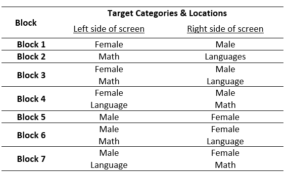

# Social Psychology Tasks

## Implicit Association Task (IAT)

Implicit Association Tasks (IATs) require participants to categorise words as fast as possible into one of two categories (e.g. pleasant vs. unpleasant). In general, faster responses suggest stronger implicit associations. After some practice blocks with only two options, participants are expected to be familiar with the target words and asked to sort them while four different target categories are present. These categories are paired, e.g. "female - pleasant", "male - unpleasant." If the paired categories match the associations held by the participant, reaction times tend to be faster. For example, if participants have positive associations with the word and/or category female, they would be expected to respond faster if "female" and "pleasant are displayed together than if "female" and "unpleasant are displayed together.

**Formats**

A task version looking at gender and maths/language studies association can be downloaded for Open Sesame. The task that can be downloaded combines the paradigms used by Smeding et al. (2016) and Nosek, Banaji, and Greenwald (2016).

[Open Sesame Online and Offline](link here) 


**Things you will need to know for your Methods section**

The task uses the male/female and math/language stimuli used by Smeding et al. (2016).

The block design is as follows:
```{r Figure6-1, out.width = '75%', fig.align = 'center', echo = FALSE, fig.cap = 'Overview of IAT blocks.'}


```


**References**


Smeding, A., Quinton, J. C., Lauer, K., Barca, L., & Pezzulo, G. (2016). [Tracking and simulating dynamics of implicit stereotypes: A situated social cognition perspective.](https://www.researchgate.net/profile/Jean-Charles_Quinton/publication/308341625_Tracking_and_Simulating_Dynamics_of_Implicit_Stereotypes_A_Situated_Social_Cognition_Perspective/links/581b4c3508aea429b28fc0d0/Tracking-and-Simulating-Dynamics-of-Implicit-Stereotypes-A-Situated-Social-Cognition-Perspective.pdf) *Journal of Personality and Social Psychology, 111*(6), 817.

Nosek, B.A., Banaji, M.R., & Greenwald, A.G. (2002).  [Math = Male, Me = Female, therefore Math ¹Me.](https://psyarxiv.com/y2g6s) *Journal of Personality and Social Psychology, 83*, 44-59