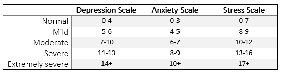

# Mental Health

## Depression and Anxiety 

### Depression, Anxiety, Stress (DASS-21)

As the name suggest, the DASS-21 measures Depression, Anxiety, and Stress Scales with 21 items. It is the abbreviated version of a 42 item questionnaire. Paper-based versions of both can be found on the official [DASS Homepage](http://www2.psy.unsw.edu.au/groups/dass/).One of the advantages of the DASS-21 is that it it available for a [wide range of languages](http://www2.psy.unsw.edu.au/groups/dass/translations.htm).


**How to use the DASS-21**

The DASS-21 measures three different scales:

- Depression Scale (D)
- Anxiety Scale (A)
- Stress Scale (S)

To see which question relates to which scale, [click here](link). Simply add up the points for each scale and then multiply the result by two. The reason we have to double the score is that the classifications of symptom strength were designed for the full 42-item DASS. Thus, if a participants scores 3 points on the Depression scale for the DASS-21, this should be multiplied by 2 (=6).


```{r Figure8-1, out.width = '80%', fig.align = 'center', echo = FALSE, fig.cap = 'Classifications for DASS scores.'}


```

**Formats**

You can download the DASS-21 as a PDF from the official [DASS Homepage](http://www2.psy.unsw.edu.au/groups/dass/) or as a Qualtrics file below.

[Qualtrics](link) 

**Source:**

Lovibond, S.H. & Lovibond, P.F. (1995).  *Manual for the Depression Anxiety Stress Scales.* (2nd. Ed.)  Sydney: Psychology Foundation.


## (Modified) Abbreviated Math Anxiety Scale

The Modified Abbreviated Math Anxiety Scale (mAMAS) was developed by Carey, Hill, Devine, and Szűcs (2017) and is based on the Abbreviated Math Anxiety Scale (AMAS) which was developed by Hopko, Mahadevan, Bare, and Hunt (2003). The wording of both scales is slightly different and in parts reflects that the data used to assess the suitability of the AMAS was collected in the US and the data used to assess suitability of the mAMAS was collected in the UK. The mAMAS can also be used to test children (approx. 8-13 years) while the use of the AMAS was verified for older teenagers and young adults.

The overall score of the AMAS and mAMAS in indicative of math anxiety in general but both measures also provide an estimate of anxiety related to being tested on mathematical knowledge and anxiety related to studying mathematics.


**How to use the (m)AMAS**

Both the AMAS and the mAMAS contain 9 questions and answers are scored on a 5-point Likert scale. Math evaluation (test) anxiety is assessed by the combined score of the even questions (2, 4, 6, 8) and math learning anxiety is assessed by the total score of the odd questions (1, 3, 5, 7, 9).


**Formats**

The AMAS and mAMAS can be downloaded as Qualtrics and Word file:

[Qualtrics - AMAS](link)|[Word - AMAS](link)
[Qualtrics - mAMAS](link)|[Word - mAMAS](link)


**Source:**

Carey, E., Hill, F., Devine, A., & Szűcs, D. (2017). [The modified abbreviated math anxiety scale: A valid and reliable instrument for use with children.](https://www.frontiersin.org/articles/10.3389/fpsyg.2017.00011/full) *Frontiers in Psychology, 8*, 11.

Hopko, D. R., Mahadevan, R., Bare, R. L., & Hunt, M. K. (2003). [The abbreviated math anxiety scale (AMAS) construction, validity, and reliability.](https://www.researchgate.net/profile/Stephen_Joy/post/Hello_Can_anyone_tell_me_how_to_access_the_Abbreviated_Math_Anxiety_Scale_developed_by_Derek_Hopko2/attachment/59d624eb79197b80779833c8/AS:315374518636545@1452202552608/download/Math+Anxiety+Scale+Abbreviated+2003.pdf) *Assessment, 10(2)*, 178-182.


## Autism

The Autism Spectrum Quotient 10 items (AQ-10) scale was developed as a quick way to decide whether further further autism diagnostics should be conducted. There three versions of the AQ-10, one for children, one for adolescents, and one for adults.

**How to use the AQ-10**

*Adult AQ-10:*

- For questions 1, 7, 8, and 10, award one point if the response was 'Slightly Agree' or 'Definitely Agree'.
- For questions 2, 3, 4, 5, 6, and 9, award one point if the response was 'Slightly Disagree' or 'Definitely Disagree'.

*Adolescent AQ-10:*

- For questions 1, 5, 8 and 10, award one point if the response was 'Slightly Agree' or 'Definitely Agree'.
- For questions 2, 3, 4, 6, 7 and 9, award one point if the response was 'Slightly Disagree' or 'Definitely Disagree'.

*Children AQ-10:*

- For questions 1, 5, 7 and 10, award one point if the response was 'Slightly Agree' or 'Definitely Agree'.
- For questions 2, 3, 4, 6, 8 and 9, award one point if the response was 'Slightly Disagree' or 'Definitely Disagree'.

A score of 6 or more suggests autistic tendencies. In a clinical context, the person would be referred for further diagnostics.

**Formats**

Qualtrics and paper-based versions of the AQ-10 can be downloaded for children, adolescents, and adults below. Versions in alternative languages can be found [here](https://www.autismresearchcentre.com/arc_tests).

[Qualtrics-Adults](link)|[Qualtrics-Adolescents](link)|[Qualtrics-Children](link) 
[Word-Adults](link)|[Word-Adolescents](link)|[Word-Children](link) 


**Source:**

Allison, C., Auyeung, B., & Baron-Cohen, S. (2012). [Toward Brief "Red Flags" for Autism Screening: The Short Autism Spectrum Quotient and the Short Quantitative Checklist in 1,000 Cases and 3,000 Controls.](http://citeseerx.ist.psu.edu/viewdoc/download?doi=10.1.1.232.4537&rep=rep1&type=pdf) *Journal of the American Acad of Child & Adolescent Psychiatry, 51*(2), 202-212.


## Internet and Social Media related
### Problematic Internet Use Questionnaire (PIUQ) 

The PIUQ was developed by Demetrovics,Szeredi, and Rózsa (2008). It assesses problematic internet use on three subscales: Obsession, Neglect, and Control Disorder. In other words, it provides an indication of how obsessed someone is with using the internet, to what degree this leads them to neglect other responsibilities, and whether they are in control of their behaviour. Each subscale contains five questions.

**How to use the PIUQ**

The PIUQ uses means related to each subscale. The mean score for each subscale can range from 6 to 30. When you analyse the data for each participant, you simply calculate their mean score for each subscale.

**Formats**

You can download the PIUQ as a Microsoft Word or as a Qualtrics file.

[Qualtrics](./questionnaires/Problematic_Internet_Use_Questionnaire_PIUQ.qsf) | 
[Word](./questionnaires/ProblematicInternetUseQuestionnaire.docx)


**Source:**

Demetrovics, Z., Szeredi, B., & Rózsa, S. (2008). [The three-factor model of Internet addiction: The development of the Problematic Internet Use Questionnaire.](https://link.springer.com/content/pdf/10.3758/BRM.40.2.563) *Behavior Research Methods, 40*, 563-574.


## General Mental Health

The Mental Health Continuum - Short Form (MHC-SF) measures general mental health in relation to emotional wellbeing, social wellbeing, and psychological wellbeing.Two versions of the MHC-SF exist, one for adults (18 years and older) and one for teenagers (12-18 years).

**How to use the MHC-SF**

The both MHC-SF versions contain 14 items and require participants to rate how often they experienced a feeling within the last month. 

*The rating scale is:*

0 = never

1 = once or twice

2 = about once a week

3 = about 2 to 3 times a week

4 = almost every day

5 = every day

Items 1-3 are linked to emotional wellbeing, Items 4-8 are linked to social wellbeing, and items 9 to 14 are linked to psychological wellbeing.

People are classified as 'flourishing' or 'languishing' based on their responses.

**Formats**

You can download the PIUQ as a Microsoft Word or as a Qualtrics file.

[Qualtrics](link) | 
[Word](link)

**Source:**

Keyes, C. L. (2002). [The mental health continuum: From languishing to flourishing in life.](https://www.researchgate.net/profile/Corey_Keyes/publication/11278728_The_Mental_Health_Continuum_From_Languishing_to_Flourishing_in_Life/links/0046352b1a6f89da77000000/The-Mental-Health-Continuum-From-Languishing-to-Flourishing-in-Life.pdf) *Journal of Health and Social Behavior,* 207-222.

Keyes, C. L. (2009). [Brief description of the mental health continuum short form (MHC-SF).](https://www.aacu.org/sites/default/files/MHC-SFEnglish.pdf)


