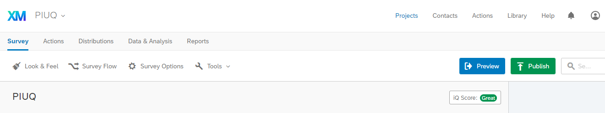
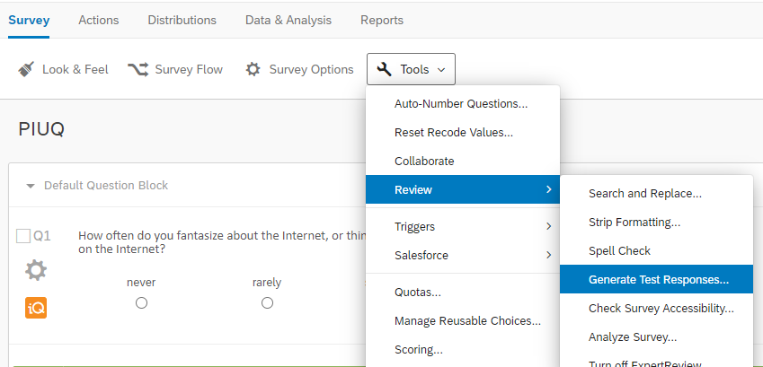

# Qualtrics

Qualtrics is an online tool that can be used to run surveys. If you want to use Qualtrics, you need to register through the University of Strathclyde. You can do this by clicking [here](https://www.strath.ac.uk/is/software/qualtrics/). The information under "How do I get it?" tells you what to do to register through the university. 

## How to import questionnaires into Qualtrics
For most questionnaires, you will have the option to download a Qualtrics file.

1. Choose a survey and download the Qualtrics file to your computer.
2. Log on to Qualtrics through the University of Strathclyde link.
3. Find the "Create New Project" option. In some cases, you may need to click on "Projects" in the menu at the top first.

```{r Figure11-2, out.width = '85%', fig.align = 'center', echo = FALSE, fig.cap = 'Click on "Create new Project" - you may need to click on "Projects" first to get the option.'}

knitr::include_graphics('images/Qualtrics/02NewProject.PNG')
```


This will take you here:

```{r Figure11-3, out.width = '85%', fig.align = 'center', echo = FALSE, fig.cap = 'Click on "Survey", framed in red.'}


```
4. Click on "Survey", which is framed in red in the picture above. This will show you the following options, for which you should choose "From a File"

```{r Figure11-4, out.width = '85%', fig.align = 'center', echo = FALSE, fig.cap = 'Choose "From a File" to upload the experiment file you downloaded earlier.'}

knitr::include_graphics('images/Qualtrics/04FromFile.PNG')
```
5. The file will not be uploaded automatically. First, you have a chance to change the project name and check that you have chosen the right file. The default project name is the file name. For this example, we are going to change it to "PIUQ". Then, click "Get Started"

```{r Figure11-5, out.width = '85%', fig.align = 'center', echo = FALSE, fig.cap = 'Check that you have chosen the correct file and re-name the survey, if you want to.'}

knitr::include_graphics('images/Qualtrics/05FromFile2.PNG')
```
6. The next screen will show you the imported questions. Check that they match the questions and responses you can find in the Word file of the survey.

```{r Figure11-6, out.width = '85%', fig.align = 'center', echo = FALSE, fig.cap = 'Make sure the answers were imported correctly.'}


```

If you click on "Projects" in the main menu, it will take you to an overview of the surveys you currently have uploaded.


## How to test data recording

### Generate pilot data
It is a good idea to test if your survey records the answers the way it is supposed to. To do this, you have two options:

**Option 1:** Click on Preview and answer the survey questions yourself. When the survey is finished, it will record your responses as it would also for a real participant.
```{r Figure11-7, out.width = '85%', fig.align = 'center', echo = FALSE, fig.cap = 'Click on Preview to see what the questions look like online and on a phone.'}

knitr::include_graphics('images/Qualtrics/08Preview.PNG')
```

**Option 2:** Let Qualtrics generate some test responses.To do this, open your survey and choose "Tools" -> "Review" -> "Generate Test Responses..."

```{r Figure11-8, out.width = '85%', fig.align = 'center', echo = FALSE, fig.cap = 'Choose "Tools" -> "Review" -> "Generate Test Responses...".'}


```

This will lead you here:
```{r Figure11-9, out.width = '85%', fig.align = 'center', echo = FALSE, fig.cap = 'By changing the number of responses, you can adjust how many test "participants" you want Qualtrics to generate.'}

knitr::include_graphics('images/Qualtrics/10testresponses2.PNG')
```

The number of "Responses" represents the number of participants, e.g. if you tell Qualtrics to generate five responses, it will create test data that looks as if five participants have responded. When you are ready, click on "Start Test."

If everything went well, you should see something like this:
```{r Figure11-10, out.width = '85%', fig.align = 'center', echo = FALSE, fig.cap = 'Output after the test data has been generated.'}


```


The data has now been generated and you can click "Close"

### Check pilot data

We can access the data by clicking on "Data and Analysis":


```{r Figure11-11, out.width = '85%', fig.align = 'center', echo = FALSE, fig.cap = 'To access the data collected with your survey, click on "Data and Analysis"'}

knitr::include_graphics('images/Qualtrics/12checkdata1.PNG')
```


Usually, your data will be shown after clicking on the tab. However, if you have only recently created the test data, it may take a little while to appear. Similarly, when your survey is online and many participants responded right before you check the data, it may take some time to update this section. In that case, you might not see data here but a message that tells you that responses are being re-indexed:


```{r Figure11-12, out.width = '85%', fig.align = 'center', echo = FALSE, fig.cap = 'To access the data collected with your survey, click on "Data and Analysis"'}

knitr::include_graphics('images/Qualtrics/13checkdata2.PNG')
```

Usually, this message should disappear after about 10 to 30 minutes. However, occasionally, it may take a little longer. If you cannot see the data after 24h, get in touch with the Qualtrics support team. Very rarely, the automatic re-indexing runs into an issue and their support team will be able to rectify this issue. Your data will **not** be lost if this happens.

After responses are re-indexed, the data tab should look like this:

```{r Figure11-13, out.width = '99%', fig.align = 'center', echo = FALSE, fig.cap = 'Data overview in "Data and Analysis"'}


```


To analyse the data, and to check if responses are exported correctly, click on "Export & Import" and then "Export data..."

```{r Figure11-14, out.width = '85%', fig.align = 'center', echo = FALSE, fig.cap = 'Choose "Export and Import" -> "Export data..." to dowload your data.'}

knitr::include_graphics('images/Qualtrics/14exportdata.PNG')
```

This will take you here:

```{r Figure11-15, out.width = '85%', fig.align = 'center', echo = FALSE, fig.cap = 'You can choose from a range of output format, e.g. Excel, SPSS.'}

knitr::include_graphics('images/Qualtrics/15exportdata.PNG')
```

Just choose the format in which you would like to download your data.

## Scoring

Unfortunately, exporting and then importing a study tends to remove scoring information from the Qualtrics file.

The Qualtrics guide on how to set up scoring can be found [here](https://www.qualtrics.com/support/survey-platform/survey-module/survey-tools/scoring/). Using scoring means you can tell Qualtrics which questions to score in reverse and which questions it should use to calculate a subscore.

If you don't want to use scoring, you can calculate scores in SPSS later.

## Importing Questions only

To import one of the prepared questionnaires, open the survey you want to add them to and click on 'Import Questions from.'


```{r Figure11-16, out.width = '85%', fig.align = 'center', echo = FALSE, fig.cap = 'Click on Import Questions from'}

knitr::include_graphics('images/Qualtrics/import.png')
```

In the next window click on **'My Surveys'** and then choose the survey that contains the question you are interested in. If the survey is a file you have downloaded from here, you can just add the whole survey, as each file only contains one question.

