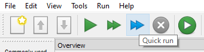

# Open Sesame

Open Sesame is a program that allows you to run experiments on a computer, tablet, or online. Most experiments included in this Experiment Library will be set up in Open Sesame, while questionnaires will be prepared for Qualtrics.

## How to install Open Sesame

The experiments included in this Experiment Library were programmed in **Open Sesame 3.3.2** To avoid problems when executing the experiments, please install the same version.

### Windows:

1. If you have a Windows computer, please check whether you have a 32-bit system or 64-bit system version of Windows installed. To find out how to do this, [click here](https://www.howtogeek.com/howto/21726/how-do-i-know-if-im-running-32-bit-or-64-bit-windows-answers/). 
2. There are two ways in which you can install Open Sesame.
    - **Option 1:** Download the program file and install Open Sesame. To choose this option, download the file that is appropriate for your Windows system:
        - [Windows 64 bit](https://github.com/smathot/OpenSesame/releases/download/release%2F3.3.2/opensesame_3.3.2-py37-win64-1.exe)
        - [Windows 32 bit](https://github.com/smathot/OpenSesame/releases/download/release%2F3.2.8/opensesame_3.2.8-py2.7-win32-1.exe)
    - **Option 2:** Download a zip-folder with all the required files. If you choose this option, you need to unzip the file and double-click *"opensesame"* everytime you want to use Open Sesame. This is less convenient but can be a good option if you cannot install new software (e.g. because of IT restrictions) or want to use different versions of Open Sesame in parallel.If you prefer this option, choose one of the following downloads:
        - [Windows 64 bit](https://github.com/smathot/OpenSesame/releases/download/release%2F3.3.2/opensesame_3.3.2-py37-win64-1.zip), 
        - [Windows 32 bit](https://github.com/smathot/OpenSesame/releases/download/release%2F3.2.8/opensesame_3.2.8-py2.7-win32-1.zip)
3. If you chose **Option 1**, double-click on the .exe file you have downloaded and follow the installation instructions. If you chose **Option 2**, unzip the folder you have downloaded. This usually takes a few minutes. Locate the *"opensesame"* file and double-click on it - the programme should now open. Figure 11.1. shows a screenshot of the contents 

```{r Figure12-1, out.width = '85%', fig.align = 'center', echo = FALSE, fig.cap = 'If you choose to dowload the zipped version of Open Sesame (Option 2), this is what you will see when you unzip the folder. Double-click on the "opensesame" file to start the program.'}


```
 
3. Check if the program opens without issues.     

### Mac OS
If you use a Mac computer, you can download Open Sesame from here:
[Mac OS](https://github.com/smathot/OpenSesame/releases/download/release%2F3.2.8/opensesame_3.2.8-py2.7-macos-1.dmg) 

In some cases, Open Sesame may be prevented from installing/launching. If you run into this issue, please follow [Apple's advice](https://support.apple.com/en-in/guide/mac-help/mh40616/mac) on how to work around this problem.


## Open Sesame Tutorials

The [official Open Sesame homepage](osdoc.cogsci.nl) has a wide range of tutorials that allow you to learn how to use it. The one I would recommend to start with is the [beginners gaze cueing paradigm](https://osdoc.cogsci.nl/3.3/tutorials/beginner/).

## Open Sesame: The Basics 

When you open Open Sesame for the first time, it will look like this. 

```{r Figure12-2, out.width = '85%', fig.align = 'center', echo = FALSE, fig.cap = 'This is what Open Sesame looks like when you open it.'}


```

So what are all of these buttons? Have a look around. When you hover over buttons, Open Sesame will tell you what they are good for.

```{r Figure12-3, out.width = '85%', fig.align = 'center', echo = FALSE, fig.cap = 'If you hover over buttons, Open Sesame will tell you their function.'}


```

To run an experiment, you have four options. Use "Run fullscreen" to test participants on a computer. Choose Quickrun or "Run in Window" to test if the experiment runs smoothly and all variables are recorded.'Run in browser' can be used to check if the experiments is suitable to run online. 

```{r Figure12-4, out.width = '85%', fig.align = 'center', echo = FALSE, fig.cap = 'Choose the option that suits your needs best.'}

knitr::include_graphics('images/opensesame/runexp.PNG')
```

If you have already downloaded one of the experiments, you can open it now and give it a try. If you have not decided on a experiment yet, Open Sesame comes with a small number of pre-installed experiments you can find by clicking on 'Tools' and choosing 'Example Experiments' 

## Starting to work with Open Sesame

If you choose one of the Open Sesame experiments, you may want to add a question or combine tasks. We will have a look at how to add some simple questions and how to combine tasks. 

Start by downloading the two (or more) files you want to combine. Open both by **double-clicking** on the files, so they open in two seperate windows. To copy elements from one experiment to another, right-click on the element you want to copy and choose 'copy'. To paste it, right-click in the location you want to copy it to and choose 'paste'

## Loggers

Open Sesame experiments should only have one Logger element in each experiment file. If you combine experiments, delete one type of logger and replace it with the other. You can do this by choosing 'copy (linked)' when you copy the logger. Then just paste it to the relevant locations.


## Open sesame on Android
**Important information for the Android version**

If you want to run an **Android version** of a task, it should only be used on tablets and not on mobile phones - unless you yourself programmed it to be used on phones. The Android app allows you to run Open Sesame on a tablet but you cannot make any changes to the experiment file. This needs to happen on a computer. Importantly, the app you will need to download is no longer developed and you may thus experience issues if you are trying to develop a new experiment in the latest Open Sesame version. To avoid these issues, **please use Open Sesame version 3.1.8.**


To download the app, search for "OpenSesame experiment runtime" in the app store or [click here](https://play.google.com/store/apps/details?id=nl.cogsci.opensesame).

The download options for this Open Sesame version are to install it (and thus replace any other version you have installed) or download it as a Zip-file that does not require installation. Instructions on how to run Open Sesame from a Zip-file are provided in the Open Sesame Chapter. Download links for version 3.1.8 are below:

Install Windows:
[64-bit](https://github.com/smathot/OpenSesame/releases/download/release%2F3.1.8/opensesame_3.1.8-py3.5-win64-1.exe) 
[32-bit](https://github.com/smathot/OpenSesame/releases/download/release%2F3.1.8/opensesame_3.1.8-py2.7-win32-1.exe) 

Install on Mac OS: [click here](https://github.com/smathot/OpenSesame/releases/download/release%2F3.1.8/opensesame_3.1.8-py2.7-macos-1.dmg) 

Download zipped folder for Windows:
[64-bit](https://github.com/smathot/OpenSesame/releases/download/release%2F3.1.8/opensesame_3.1.8-py3.5-win64-1.zip) 
[32-bit](https://github.com/smathot/OpenSesame/releases/download/release%2F3.1.8/opensesame_3.1.8-py2.7-win32-1.zip) 


**If you are downloading 3.1.8 as a Zip-File**

The file you need to execute in order to start Open Sesame is in a different location in this version of Open Sesame. Unzip the folder and open it. You will see a folder named **"Scripts"**. Open it and double-click **"opensesame"** to open Open Sesame. If you choose "Android" as a backend for your task, you can still develop new experiments for Android.
