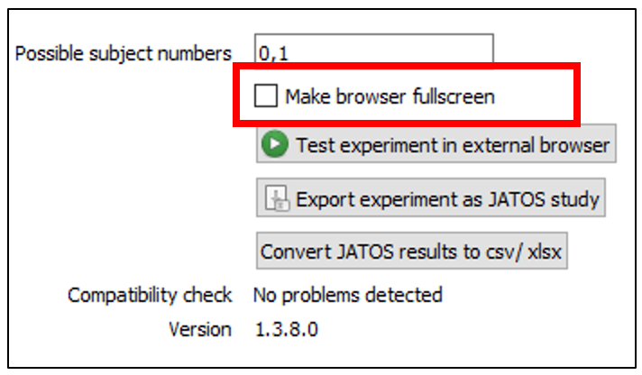
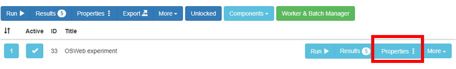
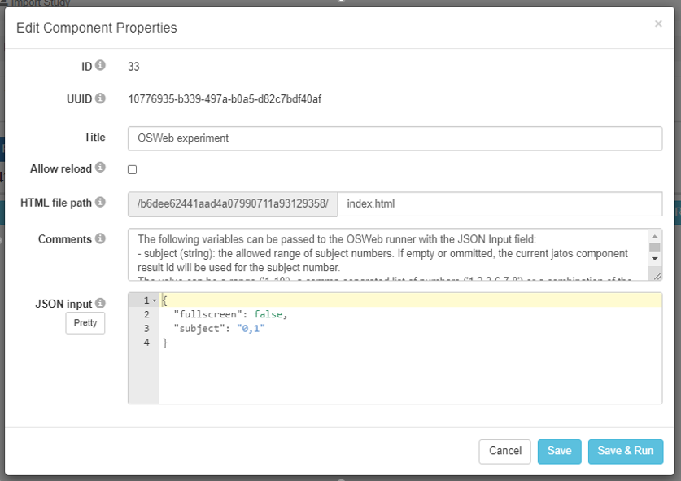

# Open Sesame - Online

The [official Open Sesame website](https://osdoc.cogsci.nl/3.2/manual/osweb/) provides some information on how to test experiments that were designed for use online. 

If you are at the University of Strathclyde, you will have access to the university's JATOS server. Students should contact their supervisor to find out how to access the server. Staff that would like to use the server but who have not received the user guide can contact [Dr Jennifer Mattschey](jennifer.mattschey@strath.ac.uk).

## Fullscreen vs. Browser Window

We can set the experiment to run in full screen at two different points of the process. First, when we export the Open Sesame experiment as a JATOS study. In the OSWeb tab (**‘Tools’ --> ‘OSWeb’**), there is the option to tick **‘Make browser fullscreen’**

```{r Figure13-1, out.width = '50%', fig.align = 'center', echo = FALSE, fig.cap = 'Option 1 is to tick fullscreen when the experiment is exported as JATOS file.'}


```

If the experiment is already uploaded and you want to change the presentation mode, go the uploaded experiment and click on **light blue component ‘Properties’ button**, framed in red below.

```{r Figure13-2, out.width = '99%', fig.align = 'center', echo = FALSE, fig.cap = 'Option 1 is to tick fullscreen when the experiment is exported as JATOS file.'}


```

This will open a window with the component properties. To change the presentation of the experiment to full screen, “fullscreen”: false, needs to be changed to “fullscreen”: true. After the change has been made and saved, the experiment will run in full screen.

```{r Figure13-3, out.width = '99%', fig.align = 'center', echo = FALSE, fig.cap = 'Option 1 is to tick fullscreen when the experiment is exported as JATOS file.'}


```


## SONA

Using JATOS with SONA is possible but you will still need to mark participants as 'participated' or 'no show'. To do this, you need to find a way to identify them.

One way to acieve this is to download this file posted to the Open Sesame forum [by clicking here](https://forum.cogsci.nl/discussion/5876/). Just copy the file into your experiment file and remember to acknowledge its source. If you want to combine Qualtrics and Open Sesame, this also allows us to link both sets of data by asking participants to enter their participant ID.

## Questionnaires

How can we add questionnaires if Open Sesame's form function can't be used online? One was is to think about the categories you want to include, e.g. native vs non-native speakers of English. In that case, "are you a native speaker of English? Press 'Y' for yes and 'N' for no" paired with a keyboard response can provide sufficient information.

For more extensive questionnaires, using Qualtrics and Open Sesame could be an option. Ask participants to enter a participant ID to link the data (see **'SONA'** above). Finally, it is possible to add a javascript questionnaire as a separate component on the JATOS server. Information on how to do this will follow soon.