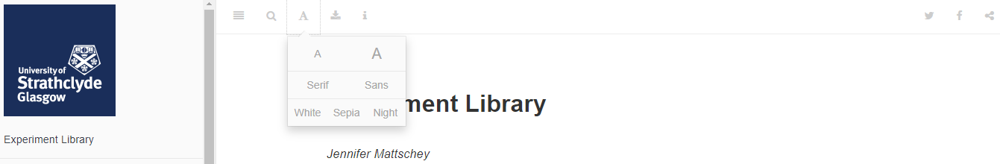

--- 
title: "Psychology Conversion Course Experiment Library"
author: "Jennifer Mattschey"
date: "`r Sys.Date()`"
site: bookdown::bookdown_site
output: bookdown::gitbook
documentclass: book
biblio-style: apalike
link-citations: yes
description: "This is a book looking at different experimental paradigms. It was developed for The University of Strathclyde online conversion course."
---

# Psychology Conversion Course Experiment Library

This collection of experiments was created for the [MSc in Psychology](https://www.strath.ac.uk/courses/postgraduatetaught/psychologywithaspecialisationinbusiness), an online Psychology conversion course run at the University of Strathclyde. The projects aim to provide students with a starting point, from which they can develop their own experiments. This 'book' can be accessed [as a open textbook online](https://jmattschey.github.io/MScConversionExperiments) or C8983: Empirical Project MyPlace page. Please note, if you are accessing the open textbook, please note that some projects are copyright protected and for these, the experiment files can only be accessed via MyPlace. Currently, only the section on intelligence tests is affected by these restrictions. If you are viewing the PDF or EPUB version, it is worth mentioning that the few gifs that have been embedded will not be displayed. To view them please access the [open textbook](https://jmattschey.github.io/MScConversionExperiments).


## Choosing an Experiment for your Research Project

This book will discuss some research paradigms and commonly used types of experiments. Each experiment will be accompanied by a finished experiment file and/or the materials required to create the experiment. We will primarily focus on tasks that run in Open Sesame and questionnaires we can use on Qualtrics.

Online experiments should generally be kept short. As a rough rule of thumb, try to aim for 20 minutes or less. Please keep this mind when you choose which tasks to include in your study. In general, it is better to have a shorter experiment that has been completed by more participants, than to have a longer experiment completed by fewer participants


## How to use the Experiment Library

For each task you will see an Open Sesame file and/or Qualtrics file included. You can download these files and use them to test participants. At the end of this book, you find chapters that explain how to use these files. However, some information on how to adapt experiment files is also provided throughout the book.


## Accessibility

If you look at the top of this page, you will see a menu with several symbols. If you click on the 'A', you can adapt the font to your liking and change the colour scheme. 
```{r Figure0-1, out.width = '95%', fig.align = 'center', echo = FALSE, fig.cap = 'Click on the A to find alternative fonts and colour schemes'}


```

It is also possible to search the Experiment Library from this menu and to download the book as epub or PDF. Please note that while the epub and PDF version contain most Figures, these versions do not currently include any Figures in gif format. If you notice a reference to a Figure that is not contained within these versions, it is likely to be a gif that you will be able to view in the online version.

## Other institutions and non-Psychology staff and students

If you are a student or member of staff at the University of Strathclyde, you will have access to all files. However, if you do not have access to the C8983: Empirical Project MyPlace page, you might have to email [Dr Jennifer Mattschey](jennifer.mattschey@strath.ac) to gain access to some of the materials. Please use your Strathclyde email address to do so.

If you are **not** a Strathclyde student or member of staff, you are still welcome to use these resources. However, some will be password protected due to copyright issues. If you use any of the experiments, please acknowledge the source of the experiment file by citing this Experiment Library.

### Adapting the Experiment Library for other courses
The Experiment Library was created using the bookdown package in R (Xie, 2016, 2020). The copyrighted material is not accessible to anyone who is not employed by or studying at the University of Strathclyde. The Experiment Library itself and openly available files are shared under the [Creative Commons Attribution-ShareAlike 4.0 International (CC BY-SA 4.0) licence](https://creativecommons.org/licenses/by-sa/4.0/). Please check the license link to check how the code and files can be used and adapted. 

**References**
Xie Y (2020). bookdown: Authoring Books and Technical Documents with R Markdown. R package version 0.20, https://github.com/rstudio/bookdown.

Xie Y (2016). bookdown: Authoring Books and Technical Documents with R Markdown. Chapman and Hall/CRC, Boca Raton, Florida. ISBN 978-1138700109, https://github.com/rstudio/bookdown.

